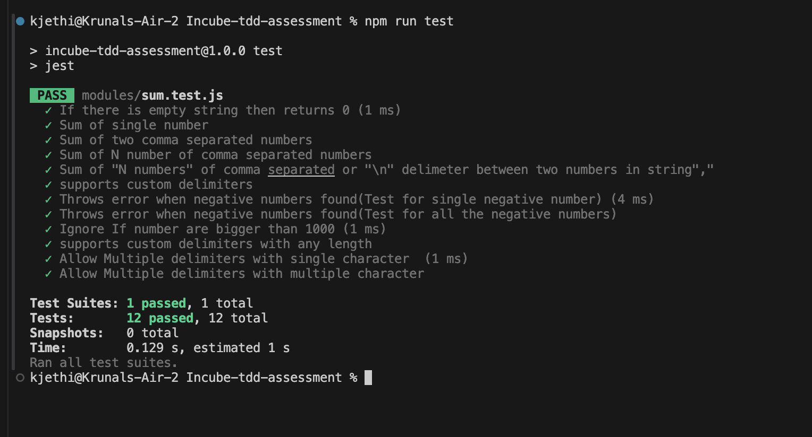
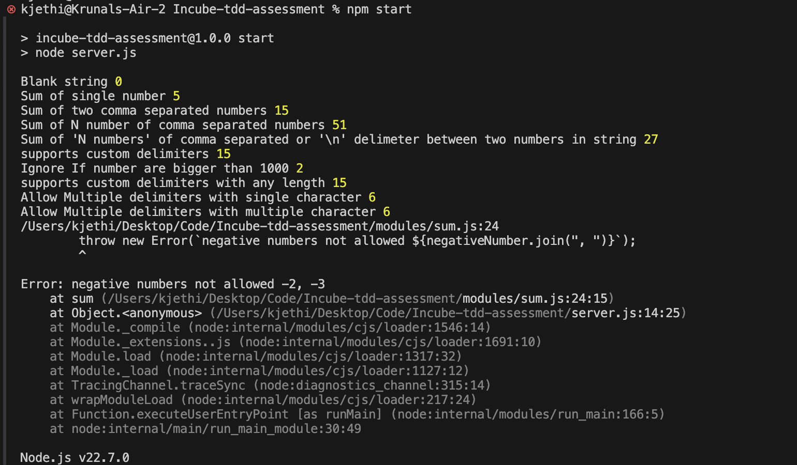

# Incube-tdd-assessment
This is for a assessment demo project which given by Incubyte company


## Installation

Install dependencies in root folder of Incube-tdd-assessment

```bash
  cd Incube-tdd-assessment
  npm install 
```

## Running Tests

To run tests, run the following command

```bash
  npm run test
```
Screenshot: 



## Running Project

To run tests, run the following command

```bash
  npm start
```
Screenshot: 



